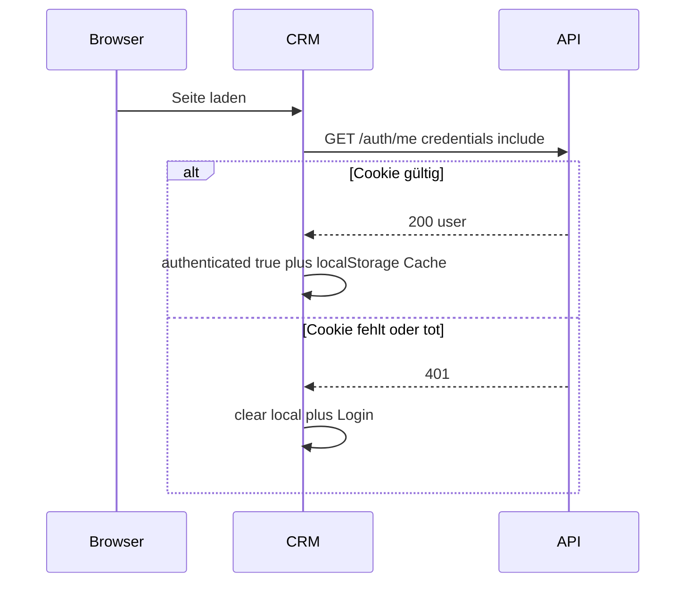

# CRM Auth & Session

Kurze Doku zu Cookie-Session, CRM-UI-State und Kunden-/Checkout-Abgrenzung (Stand Auth-Härtung).

## Architektur

| Schicht | Speicher | Rolle |
|--------|----------|--------|
| API | httpOnly-Cookie `gf_crm_session` + DB-Tabelle `Sessions` | **Source of Truth** |
| CRM | `localStorage` Key `gf:crm:user` | Nur UX-Cache (Name/Rolle), **kein** Login-Beweis |
| Rental-Frontend | Cart-`accessToken` (+ optional JWT in State nach OTP) | Unabhängig vom CRM-Cookie |

## Wichtige Regeln

1. **Niemals** `authenticated = true` nur aus localStorage setzen. Hydration wartet auf erfolgreiches `/auth/me`.
2. JWT-String wird **nur** bei `GET /auth/me` rotiert (wenn Restlaufzeit &lt; 1h). Andere API-Calls verlängern nur DB-`expiresAt` und Cookie-`maxAge` mit demselben Token — vermeidet Parallel-Request-Races (Upload/Mediathek).
3. `POST /auth/logout` braucht keine Auth (forceLogout muss Cookie immer löschen können), prüft aber `Sec-Fetch-Site` / `Origin` (nur `*.gruene-flotte.com` bzw. localhost in Dev). Cross-Site-CSRF wird abgelehnt, **ohne** das Opfer-Cookie zu clearen.
4. CRM: bei 401 oder Auth-403 (`Invalid or expired token`, `Session expired`, …) → `forceLogout` inkl. Logout-Call. Bei `"Access denied"` **kein** Logout.
5. Heartbeat alle 5 Minuten + Ping beim Öffnen von Auto-Abo Create/Edit und Mediathek.

## Betroffene Dateien

**API**

- `services/auth/authCookie.js` — Cookie-Helfer, Logout-Origin-Check
- `middleware/authMiddleware.js` — Sliding Session, JWT-Refresh nur `/auth/me`
- `controllers/auth/AuthentificationController.js` — Login ohne Body-Token, Logout, MFA 5m
- `routes/auth/AuthentificationRoute.js` — Logout ohne `authenticateToken`

**CRM**

- `stores/auth.ts` — Hydration, Heartbeat, unified `syncSessionFromServer`
- `utils/crmApi.ts` — gezielter forceLogout
- `plugins/auth.client.ts` / `middleware/auth.global.ts` — Bootstrap & Guards
- Auto-Abo Create/Edit, `SelectOrCreate` — Seller anlegen nur ADMIN

## Rental / Kunden-Checkout

Unberührt für den Happy Path:

- `POST /auth/verify-otp` und `POST /auth/cantamen/authentificate` liefern weiterhin `token` im JSON.
- `POST /contracts` ist öffentlich (Rate-Limit) und bindet über Cart-`accessToken` + `userId` am Warenkorb, nicht über CRM-Cookie.
- CRM-Heartbeat und Cookie-Sliding betreffen Kundenflows nicht.

## Bekannte bewusst belassene Punkte

- Single-Session pro User (neuer Login invalidiert andere Geräte) — Security-Entscheidung.
- Rental speichert JWT weiterhin in localStorage nach OTP (XSS-Oberfläche) — Checkout umbauen wäre größer Scope.
- Login-/MFA-JSON ohne Session-`token` (CRM); Cart-Flows behalten Body-Token.
